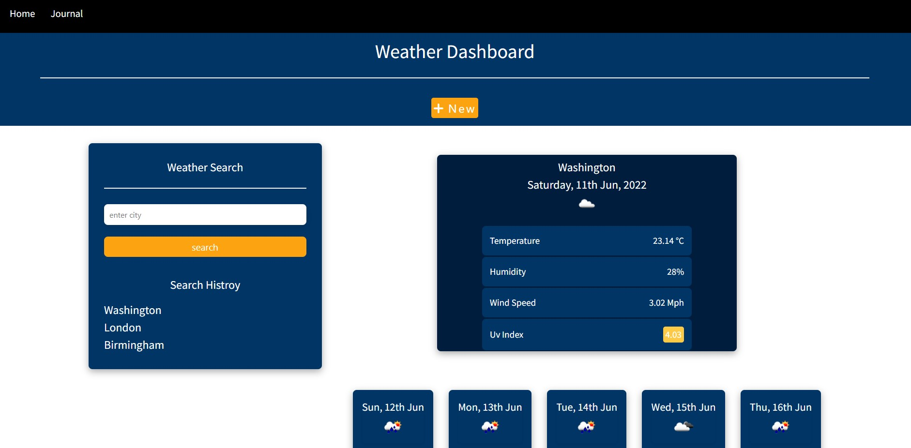

# weather-dashboard
built the css using some of Bulma framwrok 
familiarised myself with the different ways to use css classes from frameworks and identify their properties and layout 
learnt how to override or avoid any flaws coming from the css frameworks 
practised more of the Api's data functions and how to fix bugs and customise data coming from api calls
identified how to solve problems using different tecniques and the new knowledge i learnt such as the async await function
broke down the process of finding errors and iterating through functions starting with basic psuedo code
[deployed project link](https://ramielsayed.github.io/weather-dashboard/)

